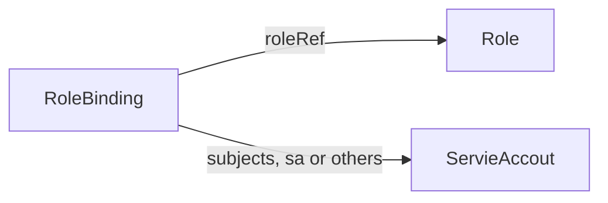
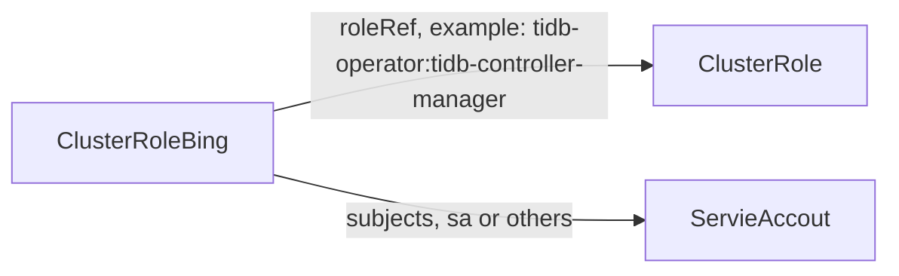

# Kubernetes RBAC

RBAC 的 Role 或 ClusterRole 中包含一组代表相关权限的规则。 这些权限是纯粹累加的（不存在拒绝某操作的规则）。

## Role

Role 总是用来在某个名字空间内设置访问权限； 在你创建 Role 时，你必须指定该 Role 所属的名字空间。



示例：TiDB Backup Manger账号的RBAC(RoleBinding, Role and ServiceAccount)

```yaml
## RoleBinding
apiVersion: rbac.authorization.k8s.io/v1
kind: RoleBinding
metadata:
  creationTimestamp: "2023-12-13T08:40:18Z"
  labels:
    app.kubernetes.io/component: tidb-backup-manager
  name: tidb-backup-manager
  namespace: tidb-admin
  resourceVersion: "250242"
  uid: ab2ba0c0-d00a-4be5-b8b9-a6d4b7388d08
roleRef:
  apiGroup: rbac.authorization.k8s.io
  kind: Role
  name: tidb-backup-manager
subjects:
- kind: ServiceAccount
  name: tidb-backup-manager

## Role
apiVersion: rbac.authorization.k8s.io/v1
kind: Role
metadata:
  creationTimestamp: "2023-12-13T08:40:07Z"
  labels:
    app.kubernetes.io/component: tidb-backup-manager
  name: tidb-backup-manager
  namespace: tidb-admin
  resourceVersion: "250220"
  uid: 43e72aaf-6376-468a-8054-576242e8c50b
rules:
- apiGroups:
  - ""
  resources:
  - events
  verbs:
  - '*'
- apiGroups:
  - pingcap.com
  resources:
  - backups
  - restores
  verbs:
  - get
  - watch
  - list
  - update

## ServiceAccount
apiVersion: v1
kind: ServiceAccount
metadata:
  creationTimestamp: "2023-12-13T08:39:59Z"
  name: tidb-backup-manager
  namespace: tidb-admin
  resourceVersion: "250188"
  uid: c3e767e8-0dbd-47d2-994a-95067d6d9dbb
```

## ClusterRole

与之相对，ClusterRole 则是一个集群作用域的资源。这两种资源的名字不同（Role 和 ClusterRole） 是因为 Kubernetes 对象要么是名字空间作用域的，要么是集群作用域的，不可两者兼具。

ClusterRole 有若干用法。你可以用它来：

定义对某名字空间域对象的访问权限，并将在个别名字空间内被授予访问权限；
为名字空间作用域的对象设置访问权限，并被授予跨所有名字空间的访问权限；
为集群作用域的资源定义访问权限。




```yaml
apiVersion: rbac.authorization.k8s.io/v1
kind: ClusterRoleBinding
metadata:
  annotations:
    meta.helm.sh/release-name: tidb-operator
    meta.helm.sh/release-namespace: tidb-admin
  creationTimestamp: "2023-12-04T09:14:19Z"
  labels:
    app.kubernetes.io/component: controller-manager
    app.kubernetes.io/instance: tidb-operator
    app.kubernetes.io/managed-by: Helm
    app.kubernetes.io/name: tidb-operator
    helm.sh/chart: tidb-operator-v1.5.1
  name: tidb-operator:tidb-controller-manager
  resourceVersion: "43413"
  uid: 317caea6-ccc6-4277-b640-409e9f5569ff
roleRef:
  apiGroup: rbac.authorization.k8s.io
  kind: ClusterRole
  name: tidb-operator:tidb-controller-manager
subjects:
- kind: ServiceAccount
  name: tidb-controller-manager
  namespace: tidb-admin
```

## 应用场景

如果你希望在名字空间内定义角色，应该使用 Role； 如果你希望定义集群范围的角色，应该使用 ClusterRole。

Role示例中资源，Role、RoleBinding、ServiceAccout都是带Namesapce的。而ClusterRole示例中的资源ClusterRole、ClusterRoleBinding、ServiceAccout只有ServiceAccount需要有Namepace，并且需要在ClusterRoleBing中指名Namepsace字段，其他资源可以不指明Namepace。